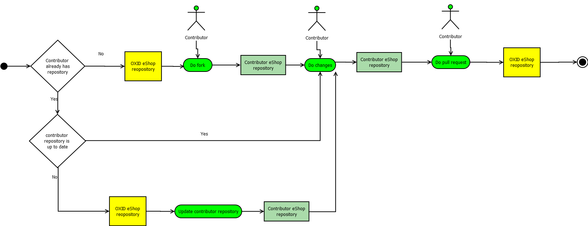

# Getting involved

OXID eShop is available under two different licenses, GPLv3 and a commercial license.

That's why, before contributing for the first time, you must <a href="https://gist.github.com/OXID-Admin/6df6ed126d074a54507d">sign the Contributor License Agreement</a>.
You can find more information about it on the FAQ page OXID Contribution and Contributor Agreement FAQ:
https://oxidforge.org/en/oxid-contribution-and-contributor-agreement-faq

## Process

First off, you have to fork the repository OXID-eSales/oxideshop_ce to your list of repositories.

### Branch naming introduction

To find the correct branch to contribute to, read this introduction to our branch naming strategy:

First one caveat: You really need to understand the difference between OXID *components* and
the eShop *compilation*. The compilation is a bundle that incorporates the shop core *and*
several essential modules. But although each *component* has it's own versioning (and follows
strict semantic versioning), it's the versioning of the *compilation*, that determines the
naming of branches that exist in the OXID eShop *components*.

The versioning of the *components* themselves may differ
from the *compilation* (which as a bundle can't follow strict semantic versioning).
So although you are contributing to a *component*, the numbering of the branches follows the
versioning of the *compilation*. The reason for this is obvious: We want to see, which changes
go to the next release and releases means that we publish a new *compilation* - although we
might have several new versions of the *component* in between.

For a better understanding take a look at the [release plan](https://oxidforge.org/en/release-plan) - as example the compilation version v6.1.0 contains the v6.3.0 version from this repository.

Of the many different branches only three types are relevant for you as a contributor in the *\<github_username\>/oxideshop_ce* repository:

* The **next major version** branch is always named **master**: All new features including compatibility breaking changes will be developed here as well as bug fixes.
* The **next minor version** branch with a name like **b-{current major}.x** for the currently maintained major version. Only Backwards compatible changes as well as new compatible features are possible.
* The **current patch** branch with a name like **b-{current major}.{current minor}.x**: bug fixes only. (will only be created if needed)
* The **previous patch** branch with a name like **b-{current major}.{previous minor}.x**: critical bug fixes only. (will only be created if needed)

In general, contributions can be taken over for all branches. Bug fixes committed to only one branch will be pushed to the other branches manually. Of course you can also consider to commit e.g. bug fixes to more than one branch.

### Finding the best branch for a pull request

* So you have found a security issue: do not create a pull request please, but instead follow the the security procedures as outlined here https://oxidforge.org/en/security - thank you!

* You have a great idea and even a working prototype for a nice new feature/improvement, but it will break the shops backwards compatibility: **master** is the best spot for you.

* Again you have a nice new feature/improvement, but you are sure it will not break backwards compatibility: if for example "6" is the current major shop version then **b-6.x** is the best spot, as it will be used for the **next minor version**.

* You have found a bug and already know the best fix: this one is a bit tricky, of course you can always create a pull request for **next minor version** as described above, but we would prefer usage of the **current patch** branch. An easy way to find the best branch is to look at https://github.com/OXID-eSales/oxideshop_metapackage_ce/releases and if a.e. the topmost entry is **v6.1.0** then the best branch to use is **b-6.1.x**.

## Development installation

1. make sure [composer](https://getcomposer.org/) is installed on your system
2. `$ git clone https://github.com/OXID-eSales/oxideshop_ce.git`
3. `$ cd oxideshop_ce`
4. `$ composer install`
5. `$ cp source/config.inc.php.dist source/config.inc.php`

If you want to install OXID eShop including example data like products, categories etc., you first need to install the demo data package:

1. `$ composer require oxid-esales/oxideshop-demodata-ce:dev-b-6.0`

### Running console command

Console command located in bin directory so use `bin/oe-console` to run the commands.

Example: 

`$ bin/oe-console oe:module:activate module-id`

### Cloning without history

To reduce the size of the repository when cloning you can use a so called "shallow clone".
With it, the history will be truncated and can save more than 90% of the disk space and traffic in comparison to a full repository clone.

Here is an example of how to use a shallow clone:

`$ git clone --depth 1 https://github.com/OXID-eSales/oxideshop_ce.git`

## Best practice

* please leave the the branch names as they are
* if you want to fix a bug or develop a new feature, define an own branch in your repository off of one of the three branches above. Name it e.g. feature/foo or bug/bugname for better tracability
* change whatever you want and push it to your forked repository
* when changes are pushed, create a Pull request on github for your branch
* additional changes to pull request can be done by making additional commits on your branch

For more information about this, please see: 
http://codeinthehole.com/writing/pull-requests-and-other-good-practices-for-teams-using-github/

Now you'll be asked for signing an OXID Contributor Agreement (this has to be done once). After that we can start checking your code. In every case, whether or not we could take over your contribution, you'll be informed.

When sending your pull request, please provide a clear, meaningful and detailed information what your code is about and what it will do, best including a screen shot if possible.
If you want to discuss your contribution and your code before committing it, please go to the dev-general mailing list: https://lists.oxidforge.org/mailman/listinfo/dev-general.

You will find technical help with Git and GitHub on this place: 
https://help.github.com/

## Code quality

Please find a collection of helpful development tools as well as a link to the OXID specific Coding style guidelines at https://oxidforge.org/en/coding-standards.html.
We also kindly request to PHP Unit tests for your code.